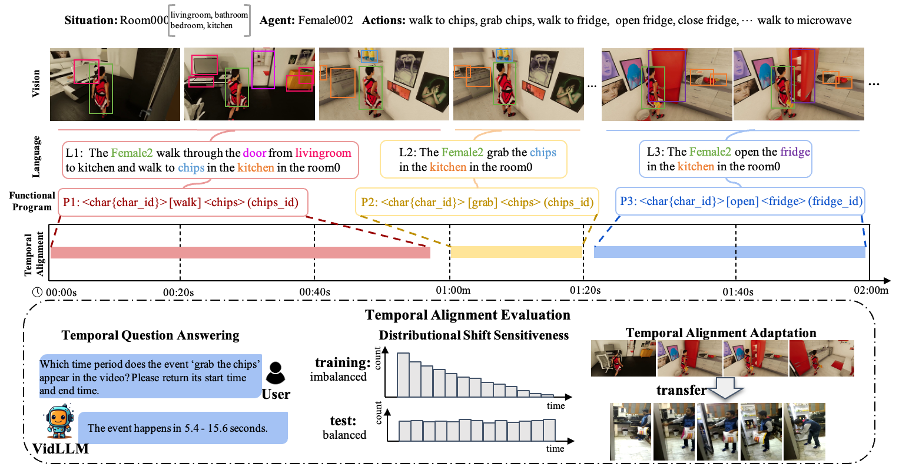

## SVLTA: Benchmarking Vision-Language Temporal Alignment via Synthetic Video Situations
[SVLTA Homepage](https://svlta-bench.github.io/SVLTA/)  

Our work aims to delve deeper into reasoning evaluations, specifically within dynamic, open-world, and structured context knowledge. 
We propose a new benchmark, consisting of 44K questions and 10K situations with instance-level annotations depicted in the videos. The reasoning process is required to understand and apply situated knowledge and general knowledge for problem-solving.
The task generation is facilitated through multiple dialogues as iterations and subsequently corrected and refined by our designed self-promptings and demonstrations.
With a corpus of both explicit situated facts and implicit commonsense, we generate associated question-answer pairs and reasoning processes, finally followed by manual reviews for quality assurance.

<!-- 
Reasoning from visual dynamics scenes has many real-world applications. However, existing video reasoning benchmarks are still inadequate since they were mainly designed for factual or situated reasoning and rarely involve broader knowledge in the real world.
-->

## Benchmark Overview
* 44k Situated Questions
* 12 Qutestion Types
* 10k Situation Video Clips
* Situation Commonsense Knowledge Graphs
* Reasoning Rationals

## Data Download

To download the dataset, please refer to the [SOK-Bench Dataset](https://github.com/csbobby/SOK-Bench?tab=readme-ov-file#data-download) 
